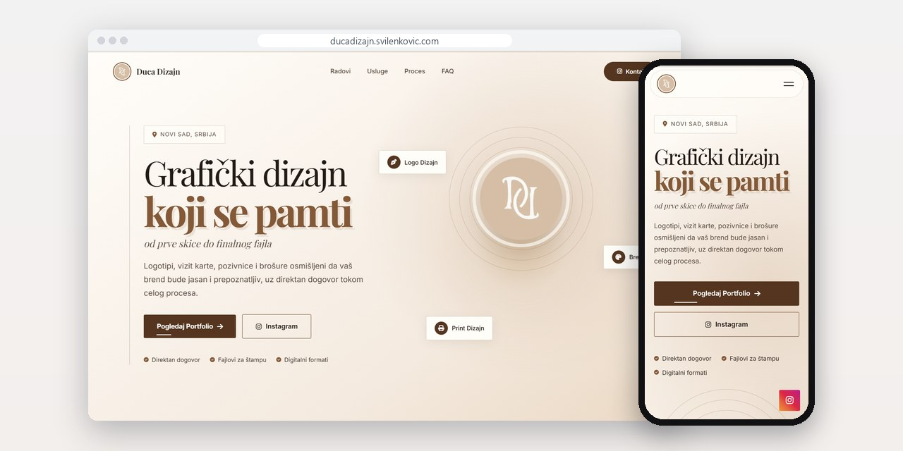
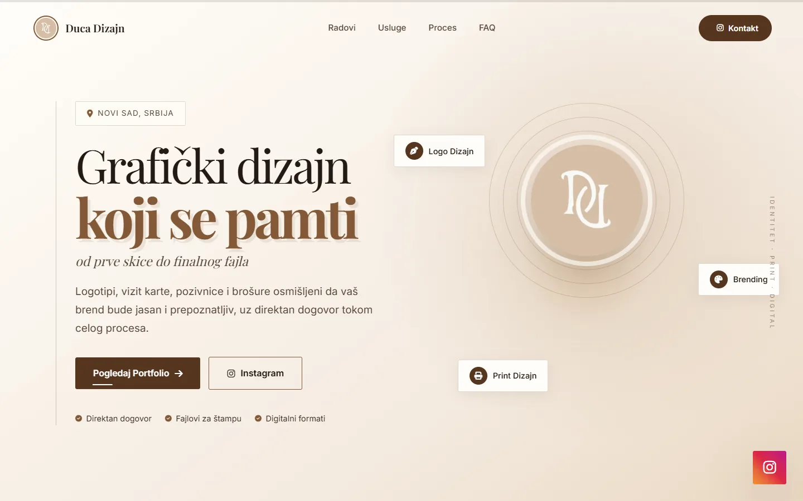
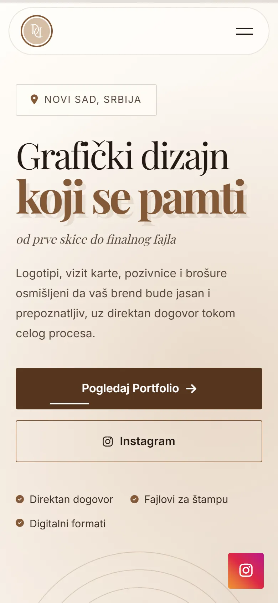
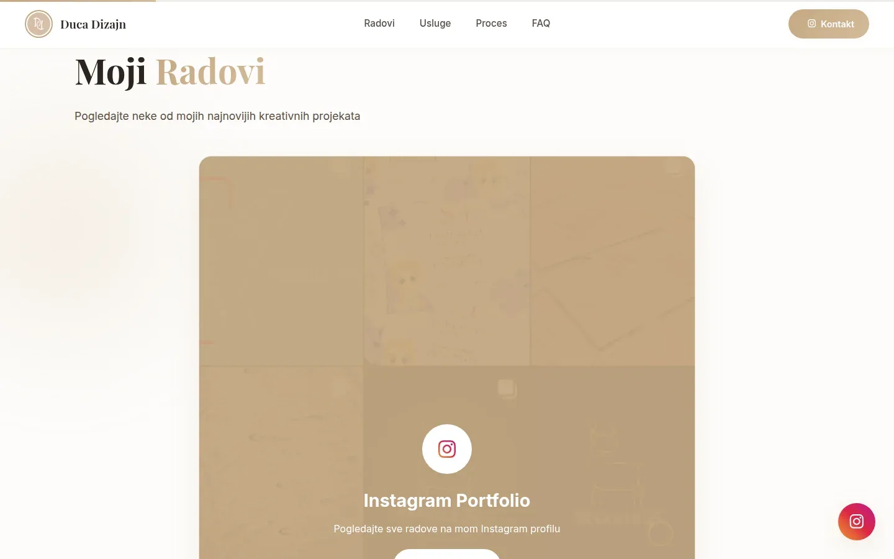
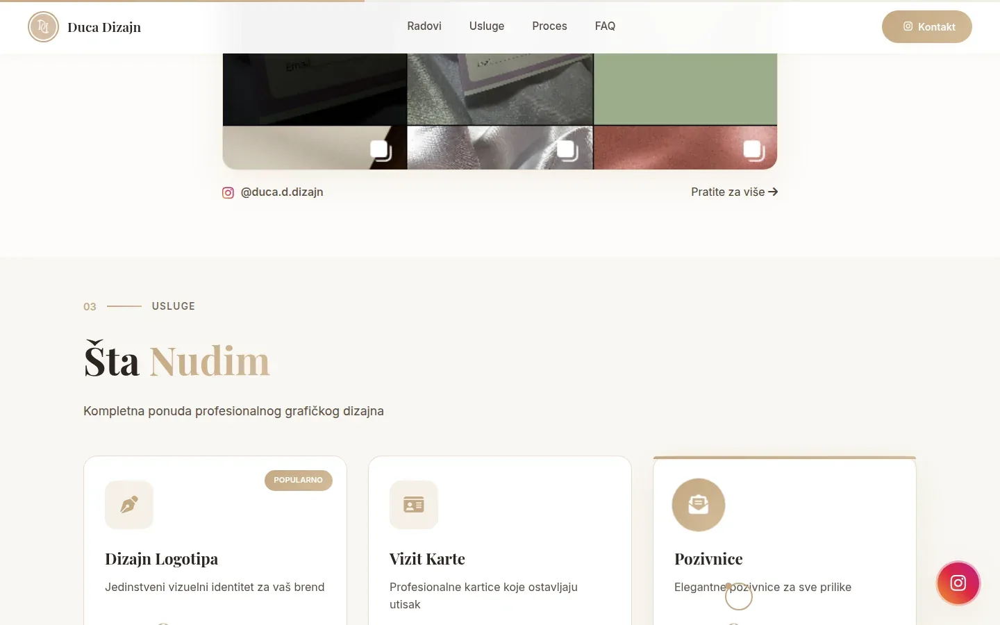

# Duca Dizajn

Concept site for a Novi Sad graphic design studio that works through Instagram: services, starting prices, process and FAQ on one page.

**[ducadizajn.svilenkovic.com](https://ducadizajn.svilenkovic.com/)** · [Case study (in Serbian)](https://svilenkovic.com/radovi/duca-dizajn) · [Srpski](README.sr.md)

> [!NOTE]
> My own demo. The source code is private. This page describes the idea and how it is built.

<table>
  <tr><td><b>Client</b></td><td>Concept project</td></tr>
  <tr><td><b>Industry</b></td><td>Graphic design: logos, business cards, invitations and print</td></tr>
  <tr><td><b>Location</b></td><td>Novi Sad, Serbia</td></tr>
  <tr><td><b>Type</b></td><td>Portfolio website</td></tr>
  <tr><td><b>My role</b></td><td>Concept, design, development, SEO and hosting</td></tr>
  <tr><td><b>Stack</b></td><td>HTML5, CSS3, vanilla JS, GSAP ScrollTrigger</td></tr>
</table>

## About the project

Duca Dizajn is a concept for a graphic design studio in Novi Sad that makes logos, business cards, wedding and party invitations and print material, and runs all its work through Instagram. The profile shows the work but does not answer what people want to know before the first message: what exactly they get, how long it takes and how payment works. This page answers that and then sends the visitor back to the profile.

I kept the site to static HTML with no CMS and no contact form, since the conversation happens on Instagram anyway. The work section is a single collage card that links to the profile, so there is no gallery that falls behind the posts. Each service shows a starting price. The same prices sit in the structured data, about twenty lines away in the same file, so the visible price and the one search engines read do not quietly drift apart.

## What I built

- One long page in five numbered sections, plus three legal pages and a 404 page that returns a real 404 status
- Four service cards, each with a short description, what is included and a starting price
- A four-step process, and four common questions marked up as FAQPage
- GSAP and Font Awesome moved from a public CDN onto the site after a stricter content security policy silently stopped the animations and icons
- A custom cursor only above 1200 px and only without reduced motion, plus a skip link and darker text for contrast on the cream background
- Analytics under Consent Mode v2 that stays off until the visitor accepts

## Results

| | Performance | Accessibility | Best practices | SEO |
| :-- | :-: | :-: | :-: | :-: |
| Mobile | 100 | 100 | 100 | 100 |
| Desktop | 100 | 100 | 100 | 100 |

PageSpeed Insights, lab test of the live site, September 2026. Security headers: 6 of 6. HTML validator: no errors. axe accessibility check: no violations. Structured data: `FAQPage`, `LocalBusiness`.

## Screenshots

<table>
  <tr>
    <td width="68%" valign="top"></td>
    <td width="32%" valign="top"></td>
  </tr>
</table>

"Moji Radovi" (My work): a collage linking straight to the profile, instead of a gallery that goes stale

"Šta Nudim" (What I offer): logos, business cards and invitations, with a starting price and what's included

---

Built by [D. Svilenković](https://svilenkovic.com).
